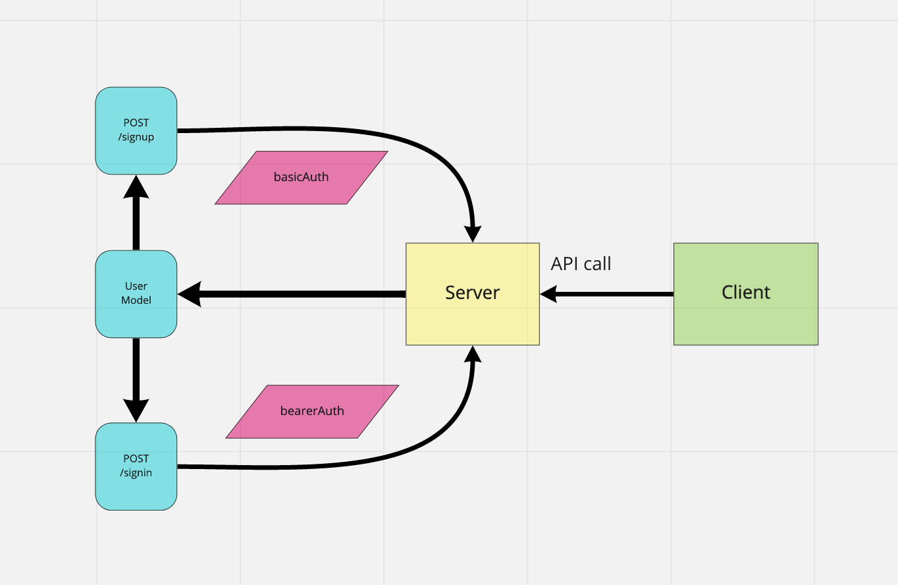

# bearer-auth

Created by Harvey Lucas

## Installation

```plaintext
> npm init -y
> npm install dotenv express jest supertest pg sequelize sequelize-cli sqlite3 base64 bcrypt cors jsonwebtoken morgan
```

## Summary of Problem Domain

### Lab: Class 07

#### Authentication Server Phase 2: Token (Bearer) Authentication

In this phase, the new requirement is that any user that has successfully logged in using basic authentication (username and password) is able to continuously authenticate … using a “token”

## Links to application deployment

PR: https://github.com/tripppdx/bearer-auth/pull/1

## Visual



## Routes

```plaintext

- Path: POST /signup
  - basic auth
- Path: POST /signin
  - basic auth
- Path: GET /users
  - bearer auth
- Path: GET /secret
  - bearer auth

```
